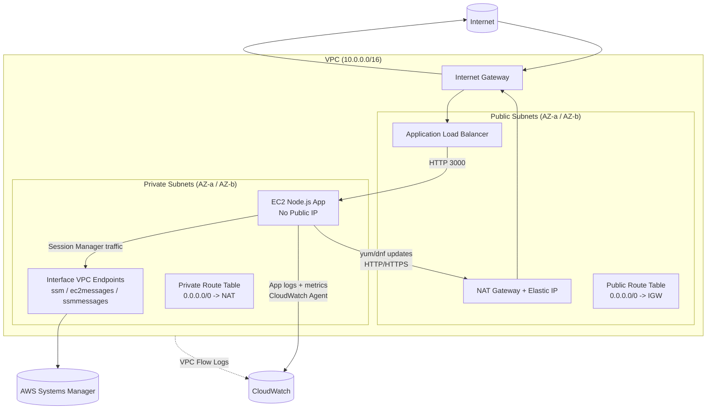

# AWS CloudWatch Terraform Project

A learning project deploying a private-by-default AWS stack with CloudWatch monitoring, EventBridge alerting, and Session Manager access. No SSH keys required.

## Architecture



---

## Project Setup

> [!IMPORTANT]  
> The instructions below assume that you have access to AWS via the CLI.

### Clone The Repo

Open your IDE or terminal, navigate to the location where you want to store the project files, and run the following command:

```
git clone https://github.com/ianzammit-devops/aws-cloudwatch-terraform-project.git
```

Open the folder in your IDE and start a terminal in the project directory.


### Setup S3 Bucket
This project uses a remote Terraform state, which means the Terraform state file is stored in AWS.

Before running terraform init, you’ll need to create an S3 bucket called **cloudwatch-project-remote-state** in your AWS account.

If you'd prefer to use a different bucket name, update lines 4 and 5 in the **terraform.tf** file to match your bucket name.

```
bucket       = "NEW_NAME_HERE"
key          = "NEW_NAME_HERE/terraform.tfstate"
```

### CloudWatch Alarms

This project includes four CloudWatch alarms, but we will only focus on the two listed below.

Please follow the testing guide later in this README to test these alarms:

- HTTP 500 errors
- CPU usage above 70%

> [!IMPORTANT]
> If you want to receive email alerts, you must set your email address on line 4 of the `terraform.tfvars` file.


---
### Terraform
Terraform needs to be initialized so it can download the required providers and configure the remote state file.
Run the following command from the project root directory:

```
terraform init
```

Now that the remote state has been configured and the required providers have been downloaded, run the following command:
```
terraform plan
```

The plan output should show that Terraform will create 55 new resources.

If you're happy with the plan, run the following command to create the resources:

```
terraform apply
```
When prompted by Terraform, type yes and press enter to confirm and create the resources.


> [!IMPORTANT]
> Check your inbox (and junk/spam folder) for an email from AWS. You must confirm the subscription before running any tests, otherwise you will not receive any email alerts.


### Terraform Outputs
The output contains a few pieces of information we need, including the load balancer URL and the Session Manager command.


Make sure that when you navigate to the load balancer URL, you prefix it with http:// and not https://, as this demo uses HTTP rather than HTTPS.

The load balancer URL is shown in the output as **alb_dns_name**. For example:
```
alb_dns_name = "aws-cloudwatch-alb-dev-170758501.eu-west-2.elb.amazonaws.com"
```
Copy the URL inside the quotes and prefix it with http://

If the setup is successful, you should see the message: "**hello from node on 3000**".

The next output to look for is **aws_session_manager_command**. This provides the command used to securely connect to the EC2 instance using Session Manager, without needing to expose port 22 (SSH).

In the terminal, paste the Session Manager command and press Enter. The command will look something like this:
```
aws ssm start-session --target i-0aca55e0dc71faf47 --region eu-west-2
```

Once connected, you should see something like:
```
Starting session with SessionId: YOURUSER-isdgrhh8y6fd6d3xlnrtl8kvre
sh-5.2$
```

### Test 1 - Stress Test The CPU
We now want to install stress, a tool we’ll use to load test the EC2 instance and trigger an alert.

In the terminal, run:
```
sudo yum install stress -y
```

If the installation is successful, you should see a **Complete!** message in the terminal.

Now we want to start the stress test. Run the following command in the terminal:

```
stress --cpu 4 --timeout 600
```

Wait around 5–12 minutes for the alarm to trigger. Do not close the terminal or stop the stress test until it has finished running or the alarm has triggered.

If you need to stop it early, you can press **CTRL + C**

You can monitor the alarm status by navigating to CloudWatch in the console and clicking **"Alarms"**.

### Test 2 - Application Errors

This test is very simple to trigger. Navigate back to the load balancer URL and append `/error` to the end of it. You should see a message that says **internal error**.

Refresh the page around 8 times and you will receive an email notifying you that the application is experiencing issues.

---

## Destroy Resources

This is a very important step in the project, as leaving resources running can incur costs.

Run the following command to destroy all resources:

```
terraform destroy -auto-approve
```